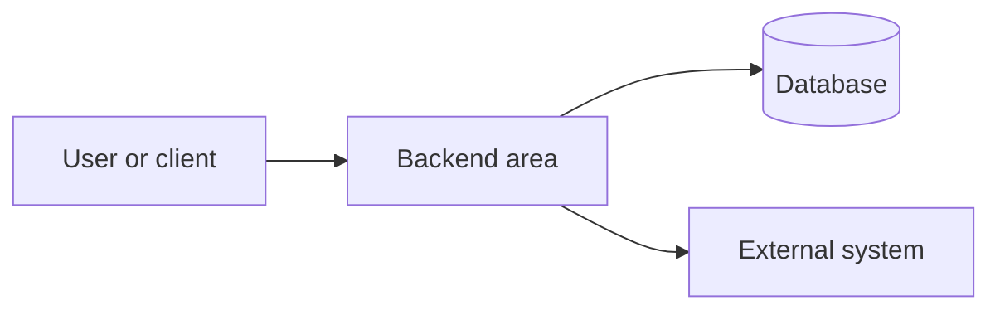

# [Backend Area] Architecture and Design

| Field           | Value                                                           |
| --------------- | --------------------------------------------------------------- |
| Audience        | [Backend developers / tech leads / reviewers / operators]       |
| Scope           | [Service, module, bounded context, route group, or integration] |
| Status          | Draft                                                           |
| Last reviewed   | YYYY-MM-DD                                                      |
| Source of truth | [Code paths, docs, ADRs, generated OpenAPI, etc.]               |

## Summary

[Two to four sentences explaining what this backend area does, why it exists, and what this document covers.]

## Goals and Non-Goals

| Type     | Item                      |
| -------- | ------------------------- |
| Goal     | [Goal]                    |
| Non-goal | [Explicitly out of scope] |

## Current Architecture

### Context

[Describe users, external systems, upstream/downstream services, and data stores.]

### Building Blocks

| Component   | Responsibility   | Evidence            |
| ----------- | ---------------- | ------------------- |
| [Component] | [Responsibility] | `path/to/file.ts:1` |

### Runtime Flows

| Flow        | Steps                 | Evidence            |
| ----------- | --------------------- | ------------------- |
| [Flow name] | [Short step sequence] | `path/to/file.ts:1` |

## Contracts and Data

| Contract or data object       | Purpose   | Owner             | Evidence            |
| ----------------------------- | --------- | ----------------- | ------------------- |
| [Endpoint/schema/table/event] | [Purpose] | [Owner or module] | `path/to/file.ts:1` |

## Cross-Cutting Concepts

| Concept                          | Current behavior    | Evidence | Gaps          |
| -------------------------------- | ------------------- | -------- | ------------- |
| Authentication and authorization | [Observed behavior] | `path`   | [Gap or none] |
| Validation                       | [Observed behavior] | `path`   | [Gap or none] |
| Error handling                   | [Observed behavior] | `path`   | [Gap or none] |
| Observability                    | [Observed behavior] | `path`   | [Gap or none] |
| Testing                          | [Observed behavior] | `path`   | [Gap or none] |

## Decisions and Trade-Offs

| Decision   | Rationale | Consequence                    | Evidence       |
| ---------- | --------- | ------------------------------ | -------------- |
| [Decision] | [Why]     | [Positive and negative impact] | [ADR/code/doc] |

## Risks and Open Questions

| Item               | Type | Impact   | Owner   | Next step |
| ------------------ | ---- | -------- | ------- | --------- |
| [Risk or question] | Risk | [Impact] | [Owner] | [Action]  |

## Maintenance

Update this document when routes, contracts, data ownership, runtime flows, cross-cutting policies, or architecture decisions change.
