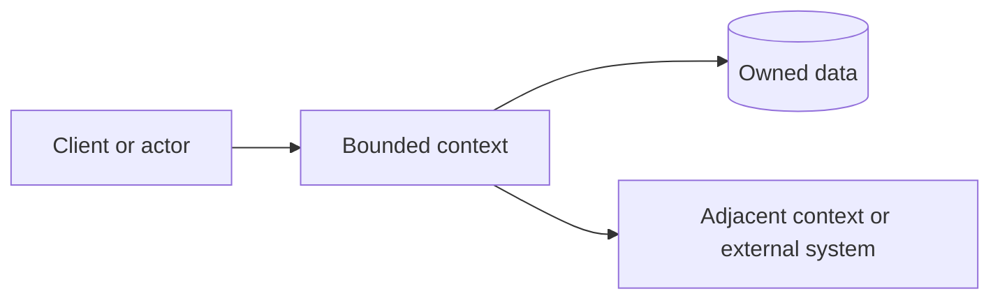

# [Backend Area] Bounded Context Map

| Field           | Value                                                      |
| --------------- | ---------------------------------------------------------- |
| Audience        | Backend developers, tech leads, and domain reviewers       |
| Scope           | [Bounded context, module, service, or capability]          |
| Last reviewed   | YYYY-MM-DD                                                 |
| Source of truth | [Code paths, docs, ADRs, generated contracts, tests, etc.] |

## Summary

[Two to four sentences describing the business capability, the proposed or observed context boundary, and the most important documentation recommendation.]

## Business Capability

| Item                | Current understanding             | Evidence      |
| ------------------- | --------------------------------- | ------------- |
| Capability          | [What business outcome it owns]   | `path`        |
| Subdomain type      | Core / Supporting / Generic       | `path or N/A` |
| Primary actors      | [Users, systems, jobs, services]  | `path`        |
| Ubiquitous language | [Important terms and definitions] | `path`        |

## Context Boundary

| Inside this context              | Outside this context           | Evidence |
| -------------------------------- | ------------------------------ | -------- |
| [Entities, use cases, contracts] | [Adjacent contexts or systems] | `path`   |

## Model and Responsibilities

| Element   | Responsibility   | DDD role                               | Evidence            |
| --------- | ---------------- | -------------------------------------- | ------------------- |
| [Element] | [Responsibility] | Entity / Value Object / Use Case / DTO | `path/to/file.ts:1` |

## Relationships and Coupling

| Relationship | Contract or dependency | Coupling type                             | Risk   | Evidence |
| ------------ | ---------------------- | ----------------------------------------- | ------ | -------- |
| [A -> B]     | [Schema, table, call]  | Contract / Model / Functional / Intrusive | [Risk] | `path`   |

## DDD and Architecture Observations

| Observation | Type                                                     | Evidence | Impact   | Recommendation    | Confidence |
| ----------- | -------------------------------------------------------- | -------- | -------- | ----------------- | ---------- |
| [Finding]   | Strategic DDD / Tactical DDD / Architecture / Data / API | `path`   | [Impact] | [Small next step] | High       |

## Documentation Recommendations

| Priority | Document or section    | Reader   | Why it matters | Evidence | Next action |
| -------- | ---------------------- | -------- | -------------- | -------- | ----------- |
| High     | [Doc to create/update] | [Reader] | [Impact]       | `path`   | [Action]    |

## Unknowns

| Unknown   | Why it matters | How to resolve |
| --------- | -------------- | -------------- |
| [Unknown] | [Impact]       | [Next step]    |

## Maintenance

Update this map when the context boundary changes, domain language changes, public contracts move, data ownership changes, or implementation starts sharing internals with another context.
