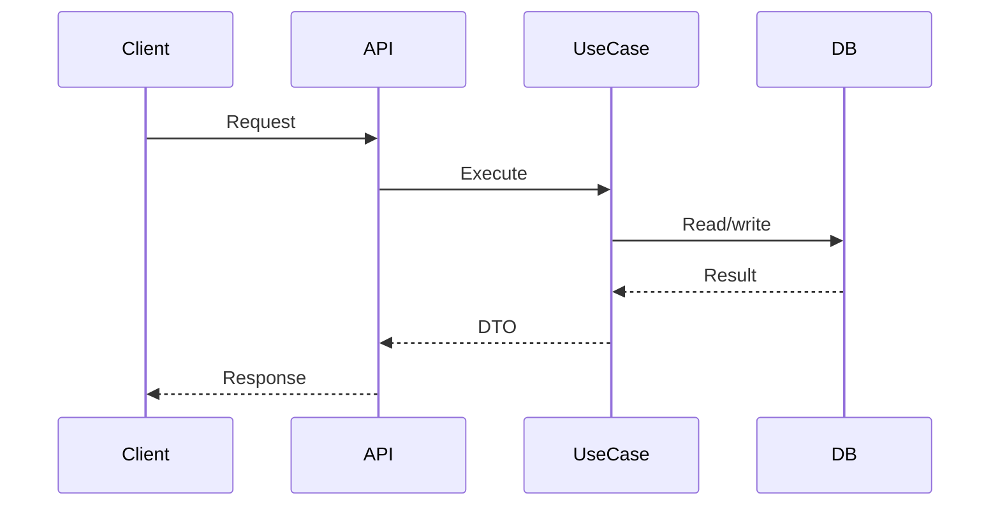

# [Backend Area] Developer Onboarding

| Field                   | Value                                             |
| ----------------------- | ------------------------------------------------- |
| Audience                | New backend developer                             |
| Scope                   | [Repository, service, module, or bounded context] |
| Last reviewed           | YYYY-MM-DD                                        |
| Expected starting point | [Prerequisites]                                   |

## What This Backend Area Does

[Explain the business capability in plain language. Define important domain terms.]

## First Map

| Area                  | What to know                            | Where to look       |
| --------------------- | --------------------------------------- | ------------------- |
| Entry point           | [How the app or worker starts]          | `path/to/file.ts:1` |
| Routes or handlers    | [Main request/event entry points]       | `path/to/file.ts:1` |
| Use cases or services | [Where business flow lives]             | `path/to/file.ts:1` |
| Domain model          | [Key entities/value objects/aggregates] | `path/to/file.ts:1` |
| Data                  | [Tables, repositories, migrations]      | `path/to/file.ts:1` |
| Tests                 | [Most useful tests to read first]       | `path/to/test.ts:1` |

## Local Development

| Task                 | Command or location      | Notes   |
| -------------------- | ------------------------ | ------- |
| Install dependencies | `[command]`              | [Notes] |
| Start backend        | `[command]`              | [Notes] |
| Run tests            | `[command]`              | [Notes] |
| Run typecheck/lint   | `[command]`              | [Notes] |
| Database setup       | `[command or docs path]` | [Notes] |

## Core Flow Walkthrough

### [Flow Name]

1. [Step with code reference]
2. [Step with code reference]
3. [Step with code reference]

## How to Make a Safe First Change

| Change type         | Start here | Checks to run | Review risk |
| ------------------- | ---------- | ------------- | ----------- |
| API contract change | `path`     | `[command]`   | [Risk]      |
| Domain rule change  | `path`     | `[command]`   | [Risk]      |
| Database change     | `path`     | `[command]`   | [Risk]      |
| Integration change  | `path`     | `[command]`   | [Risk]      |

## Common Pitfalls

| Pitfall   | Why it happens | How to avoid |
| --------- | -------------- | ------------ |
| [Pitfall] | [Cause]        | [Action]     |

## Glossary

| Term   | Meaning in this backend |
| ------ | ----------------------- |
| [Term] | [Definition]            |

## Maintenance

Update this document when setup commands, core flows, module ownership, test strategy, or onboarding pitfalls change.
