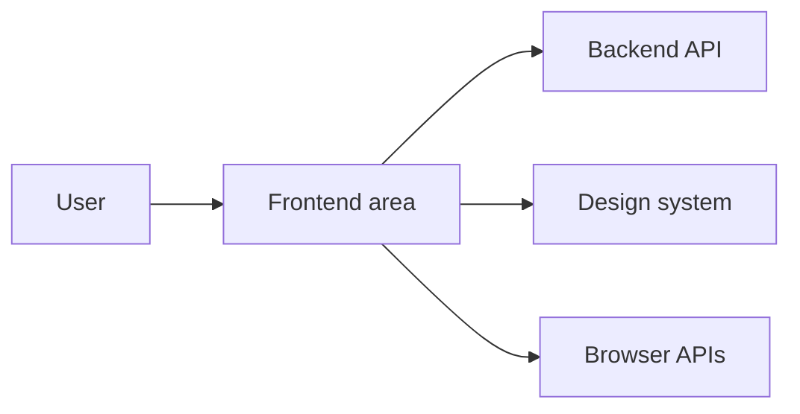

# [Frontend Area] Architecture and Design

| Field           | Value                                                                       |
| --------------- | --------------------------------------------------------------------------- |
| Audience        | [Frontend developers / tech leads / reviewers / designers / QA]             |
| Scope           | [App, route group, domain system, component set, or design-system area]     |
| Status          | Draft                                                                       |
| Last reviewed   | YYYY-MM-DD                                                                  |
| Source of truth | [Code paths, docs, DESIGN.md, Storybook, tests, generated route tree, etc.] |
| Stack focus     | [React / Vite / TanStack Router / TanStack Query / Tailwind / other]        |

## Summary

[Two to four sentences explaining what this frontend area does, why it exists, and what this document covers.]

## Goals and Non-Goals

| Type     | Item                      |
| -------- | ------------------------- |
| Goal     | [Goal]                    |
| Non-goal | [Explicitly out of scope] |

## Current Architecture

### Context

[Describe users, routes, backend APIs, design-system packages, external services, and runtime surfaces.]

### Building Blocks

| Component or layer       | Responsibility   | Evidence             |
| ------------------------ | ---------------- | -------------------- |
| [Route/system/component] | [Responsibility] | `path/to/file.tsx:1` |

### Feature System Map

| System or domain    | Public API | Internal layers                      | Boundary notes | Evidence |
| ------------------- | ---------- | ------------------------------------ | -------------- | -------- |
| `systems/[domain]/` | [Exports]  | [adapters/lib/hooks/components/etc.] | [Observed]     | `path`   |

### Runtime and Data Flows

| Flow        | Steps                 | Evidence             |
| ----------- | --------------------- | -------------------- |
| [Flow name] | [Short step sequence] | `path/to/file.tsx:1` |

## Contracts and State

| Contract or state object                  | Purpose   | Owner             | Evidence            |
| ----------------------------------------- | --------- | ----------------- | ------------------- |
| [Route/query/store/component prop/schema] | [Purpose] | [Owner or system] | `path/to/file.ts:1` |

## Cross-Cutting Concepts

| Concept                        | Current behavior    | Evidence | Gaps          |
| ------------------------------ | ------------------- | -------- | ------------- |
| Routing and navigation         | [Observed behavior] | `path`   | [Gap or none] |
| Vite/build/runtime             | [Observed behavior] | `path`   | [Gap or none] |
| Server state and data fetching | [Observed behavior] | `path`   | [Gap or none] |
| Client state                   | [Observed behavior] | `path`   | [Gap or none] |
| Design system and tokens       | [Observed behavior] | `path`   | [Gap or none] |
| Accessibility and UI states    | [Observed behavior] | `path`   | [Gap or none] |
| Testing and stories            | [Observed behavior] | `path`   | [Gap or none] |

## Decisions and Trade-Offs

| Decision   | Rationale | Consequence                    | Evidence       |
| ---------- | --------- | ------------------------------ | -------------- |
| [Decision] | [Why]     | [Positive and negative impact] | [ADR/code/doc] |

## Risks and Open Questions

| Item               | Type | Impact   | Owner   | Next step |
| ------------------ | ---- | -------- | ------- | --------- |
| [Risk or question] | Risk | [Impact] | [Owner] | [Action]  |

## Maintenance

Update this document when routes, systems, data contracts, component ownership, design-system rules, accessibility requirements, or runtime flows change.
