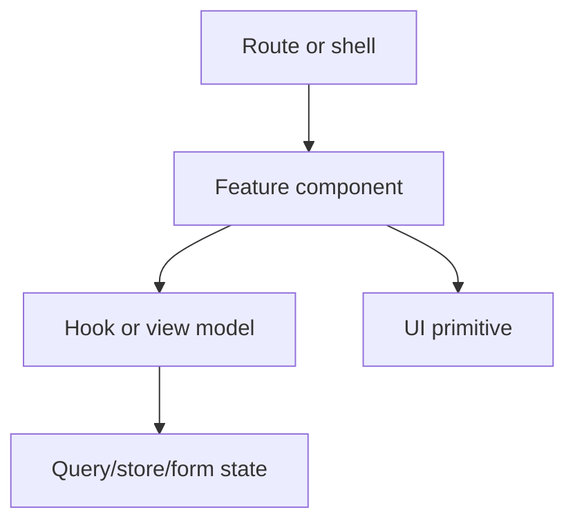

# [Frontend Area] Component System Map

| Field           | Value                                                                             |
| --------------- | --------------------------------------------------------------------------------- |
| Audience        | Frontend developers, designers, design-system owners, reviewers                   |
| Scope           | [Component set, domain system, route group, or design-system area]                |
| Last reviewed   | YYYY-MM-DD                                                                        |
| Source of truth | [Components, DESIGN.md, token files, stories, tests, rendered verification, etc.] |

## Summary

[Two to four sentences describing the component system, user-facing purpose, and the most important documentation recommendation.]

## Component Inventory

| Component   | Role                                           | Owner            | Depends on                       | Evidence                  |
| ----------- | ---------------------------------------------- | ---------------- | -------------------------------- | ------------------------- |
| [Component] | [Primitive / composed / feature / route-level] | [System/package] | [Tokens/primitives/hooks/stores] | `path/to/component.tsx:1` |

## Feature System Placement

| Component   | System owner        | Public/exported? | Imports from adapters? | Route-level only? | Evidence |
| ----------- | ------------------- | ---------------- | ---------------------- | ----------------- | -------- |
| [Component] | `systems/[domain]/` | [Yes/no]         | [Yes/no]               | [Yes/no]          | `path`   |

## Design-System Dependencies

| Dependency          | Current use                        | Evidence | Gaps          |
| ------------------- | ---------------------------------- | -------- | ------------- |
| Tokens              | [Color/type/spacing/radius/motion] | `path`   | [Gap or none] |
| Primitives          | [shadcn/Radix/local primitives]    | `path`   | [Gap or none] |
| Variants            | [CVA/variant pattern]              | `path`   | [Gap or none] |
| Dark mode           | [Behavior]                         | `path`   | [Gap or none] |
| Responsive behavior | [Behavior]                         | `path`   | [Gap or none] |

## DESIGN.md Compliance

Use this section only when root `DESIGN.md` exists.

| Check                        | Current behavior | Evidence     | Gap           |
| ---------------------------- | ---------------- | ------------ | ------------- |
| TSX token/color use          | [Observed]       | `path.tsx:1` | [Gap or none] |
| TSX inline styles            | [Observed]       | `path.tsx:1` | [Gap or none] |
| CSS token use                | [Observed]       | `path.css:1` | [Gap or none] |
| Icon family and SVG color    | [Observed]       | `path.tsx:1` | [Gap or none] |
| Typography/copy/motion rules | [Observed]       | `path.tsx:1` | [Gap or none] |

## State Matrix

| Component   | Default  | Hover/active | Focus-visible | Disabled | Loading  | Empty    | Error    | Success  | Evidence |
| ----------- | -------- | ------------ | ------------- | -------- | -------- | -------- | -------- | -------- | -------- |
| [Component] | [Yes/no] | [Yes/no]     | [Yes/no]      | [Yes/no] | [Yes/no] | [Yes/no] | [Yes/no] | [Yes/no] | `path`   |

## Accessibility Map

| Component or pattern | Semantics  | Keyboard/focus | Labels/errors | Evidence | Gaps          |
| -------------------- | ---------- | -------------- | ------------- | -------- | ------------- |
| [Component]          | [Observed] | [Observed]     | [Observed]    | `path`   | [Gap or none] |

## Composition and Data Relationships

| Relationship | Contract or dependency                   | Risk   | Evidence |
| ------------ | ---------------------------------------- | ------ | -------- |
| [A -> B]     | [Props, hook, context, token, primitive] | [Risk] | `path`   |

## Tests, Stories, and Verification

| Asset                   | Coverage                    | Evidence | Gap           |
| ----------------------- | --------------------------- | -------- | ------------- |
| [Test/story/screenshot] | [Behavior or state covered] | `path`   | [Gap or none] |

## Documentation Recommendations

| Priority | Document or section    | Reader   | Why it matters | Evidence | Next action |
| -------- | ---------------------- | -------- | -------------- | -------- | ----------- |
| High     | [Doc to create/update] | [Reader] | [Impact]       | `path`   | [Action]    |

## Unknowns

| Unknown   | Why it matters | How to resolve |
| --------- | -------------- | -------------- |
| [Unknown] | [Impact]       | [Next step]    |

## Maintenance

Update this map when component ownership, variants, tokens, accessibility behavior, stories/tests, or route-level composition changes.
