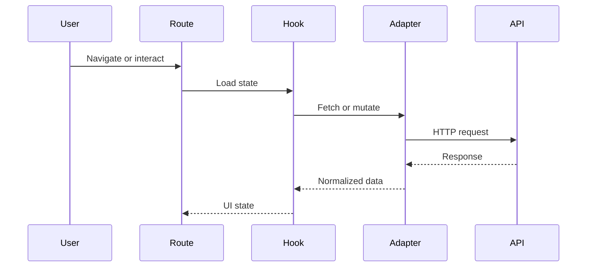

# [Frontend Area] Developer Onboarding

| Field                   | Value                                                                |
| ----------------------- | -------------------------------------------------------------------- |
| Audience                | New frontend developer                                               |
| Scope                   | [Repository, app, route group, domain system, or design-system area] |
| Last reviewed           | YYYY-MM-DD                                                           |
| Expected starting point | [Prerequisites]                                                      |

## What This Frontend Area Does

[Explain the user-facing capability in plain language. Define important product and UI terms.]

## First Map

| Area               | What to know                              | Where to look                |
| ------------------ | ----------------------------------------- | ---------------------------- |
| App entry point    | [How the app starts]                      | `path/to/file.tsx:1`         |
| Vite/build setup   | [Plugins, aliases, env, scripts]          | `vite.config.ts:1`           |
| Router and layouts | [Main route ownership]                    | `path/to/route.tsx:1`        |
| Domain systems     | [Feature system shape]                    | `path/to/system/index.ts:1`  |
| Data layer         | [Adapters, query options, mutations]      | `path/to/query-options.ts:1` |
| Components         | [Primary UI components/primitives]        | `path/to/component.tsx:1`    |
| Design system      | [Tokens, primitives, variants, docs]      | `DESIGN.md:1`                |
| Tests and stories  | [Most useful tests/stories to read first] | `path/to/test.tsx:1`         |

## Local Development

| Task                         | Command or location      | Notes   |
| ---------------------------- | ------------------------ | ------- |
| Install dependencies         | `[command]`              | [Notes] |
| Start frontend               | `[command]`              | [Notes] |
| Run tests                    | `[command]`              | [Notes] |
| Run typecheck/lint           | `[command]`              | [Notes] |
| Run Storybook or visual docs | `[command or docs path]` | [Notes] |

## Core Flow Walkthrough

### [Flow Name]

1. [Step with code reference]
2. [Step with code reference]
3. [Step with code reference]

## How to Make a Safe First Change

| Change type             | Start here | Checks to run | Review risk |
| ----------------------- | ---------- | ------------- | ----------- |
| Route change            | `path`     | `[command]`   | [Risk]      |
| Query or adapter change | `path`     | `[command]`   | [Risk]      |
| Component change        | `path`     | `[command]`   | [Risk]      |
| Design-system change    | `path`     | `[command]`   | [Risk]      |
| Store/state change      | `path`     | `[command]`   | [Risk]      |

## Feature System Rules

| Rule                      | What to check                                    | Evidence |
| ------------------------- | ------------------------------------------------ | -------- |
| Dependency flow           | `adapters -> lib -> hooks -> components`         | `path`   |
| Query options             | Keys and query functions co-located for reuse    | `path`   |
| API adapter contract      | Typed errors and `AbortSignal` where cancellable | `path`   |
| Public barrel             | Explicit named exports from `systems/<domain>/`  | `path`   |
| Route/system relationship | Routes consume public system APIs                | `path`   |

## Common Pitfalls

| Pitfall   | Why it happens | How to avoid |
| --------- | -------------- | ------------ |
| [Pitfall] | [Cause]        | [Action]     |

## Glossary

| Term   | Meaning in this frontend |
| ------ | ------------------------ |
| [Term] | [Definition]             |

## Maintenance

Update this document when setup commands, route ownership, system structure, design-system rules, test strategy, or onboarding pitfalls change.
